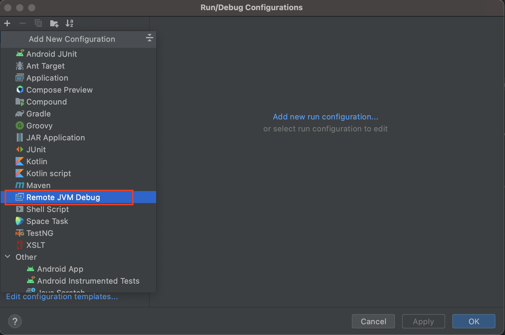

# 容器化本地开发环境

本虚拟开发环境提供了快捷的、跨平台的、一致开发体验，可有效地管理复杂的技术栈设置。
通过 docker 容器减少了对宿主机的配置污染。 本开发环境预装了以下中间件：

* MariaDB
* TiDB
* Redis
* RocketMQ
* ElasticSearch
* nginx
* nacos
* powerjob
* etcd

其它需要的中间件可以按需扩充。

下表列出了这些中间件的宿主机中的端口以及 web 管理界面的地址。

|  序号 | 中间件        | 端口 | web 管理界面链接            |
| ----- | ------------- | ---- | --------------------------- |
|  01   | MariaDB       | 3306 |                             |
|  02   | TiDB          | 4000 |                             |
|  03   | Redis         | 7001 |                             |
|  04   | RocketMQ      | 9876 | http://127.0.0.1:7080       |
|  05   | ElasticSearch | 9200 | http://127.0.0.1:5601       |
|  06   | nacos         | 8848 | http://127.0.0.1:8848/nacos |
|  07   | powerjob      | 7700 | http://127.0.0.1:7700       |
|  08   | rabbitmq      | 5672 | http://127.0.0.1:15672      |

## 开发环境安装

本项目开发环境在 MacOS 测试验证过，理论上也可以在 Linux 及 Windows 运行。
使用本项目开发环境时请安装 Docker Desktop 3.5。[MacOS 版本下载地址][1]
此外，为方便使用命令行工具，安装配置好相关工具：

- mysql client
- redis client
- git
- tmux
- jq
- curl
- xxd

接下来需要配置一下主机的 /etc/hosts 文件，加入以下主机名映射回环地址：

    127.0.0.1	mariadb
    127.0.0.1	tidb
    127.0.0.1	namesrv
    127.0.0.1	rocketmq
    127.0.0.1	mysql
    127.0.0.1	redis
    127.0.0.1	nacos
    127.0.0.1	powerjob

以上步骤完成后请克隆 [localenv 项目 git 库][2]，命令如下：

    cd ~/work
    git clone https://github.com/schnell18/localenv.git

然加后端项目到 localenv/backends 下。
以下是以 riemann 项目为例的命令，请根据你的实际情况替换项目名称。

    cd ~/localenv
    mkdir backends
    cd backends
    git clone git@<your_git_server>/<your_backend_project>.git

前端项目到 localenv/frontends 下。

    cd ~/localenv
    mkdir frontends
    cd frontends
    git clone git@<your_git_server>/<your_frontend_project>.git

## 启动环境

启动完整的环境需要消耗较多的内存，如果只需要某些特定容器，可以指定相应的
infra 名称。

    cd ~/localenv
    ./infractl list

如只想启动 MariaDB，那么可以运行以下命令：

    ./infractl.sh start mariadb

比如只想启动 MariaDB 和 Redis，那么可以运行以下命令：

    ./infractl.sh start mariadb redis

下表是 `infractl.sh` 支持的 infra：

|  序号 | 参数名称                    | 作用说明                        |
| ----- | --------------------------- | ------------------------------- |
|  01   | elasticsearch               | 启动 ES 相关的容器              |
|  02   | mariadb                     | 启动 MariaDB 相关的容器         |
|  03   | redis                       | 启动 Redis                      |
|  04   | rocketmq                    | 启动 RocketMQ 相关的容器        |
|  05   | tidb                        | 启动 TiDB                       |
|  06   | nacos                       | 启动 nacos                      |
|  07   | powerjob                    | 启动 powerjob                   |
|  08   | etcd                        | 启动 etcd                       |

环境启动后可以通过以下命令检测各个容器是否正常工作：

    ./infractl.sh status all

## Redis

### Redis 集群模式

本项目开发环境的 Redis 是 3 个节点的集群模式。端口为 7001～7003。
请使用连接密码 abc123 连接该集群。
你可根据自己的喜好使用相应的工具连接 Redis。
如果使用 tmux 的话，可以用 tumx.sh 自动打开命令行 rediscli 工具连接到 redis。

## MariaDB (MySQL)

本项目开发环境的 MariaDB （和兼容 MySQL 的变种） 服务器可以通过 127.0.0.1:3306
访问。用户为 mfg 密码为 abc。 root 密码为 root。你可根据自己的喜好使用相应的工具连接该数据库。
如果使用 tmux 的话，可以用 tumx.sh 自动打开命令行 mysql 工具连接到数据库。

MariaDB 的数据文件保存在 .state/mariadb/data 目录下。
重启本项目的开发环境不会导致数据丢失。

## RocketMQ

开发环境启动后，RocketMQ 的管理界面可以通过 http://rocketmq:7800 访问管理界面。
也可以使用 ./infractl.sh webui rocketmq 命令自动打开浏览器。

用户名可自行注册。

RocketMQ 的数据文件保存在 .state/rocketmq/broker1/store 目录下。
重启本项目的开发环境不会导致数据丢失。

## PowerJob

PowerJob 是个功能丰富的分布式任务调度中间件。本项目集成了 PowerJob 服务器及用于执行任务的任务代理节点。
PowerJob 依赖数据库，本项目的示例使用了 mariadb。
因此，启动 PowerJob 服务器请使用以下命令：

    ./infractl.sh start mariadb powerjob

任务代理节点需要和应用一起部署。本项目的实例将该代理放在应用 haydn 中。所以启动改用应及定时任务代理用以下命令：

    ./appctl.sh start haydn haydn-job-agent

以上命令会自动注册应用名和密码均为 `haydn` 的应用，登录管理界面时需要使用。
环境启动后，PowerJob 的管理界面可以通过 http://powerjob:7700 访问。
也可以使用 ./infractl.sh webui powerjob 命令自动打开浏览器。

## 加载数据

本项目开发环境提供了工具方便开发重新加载数据。
应用和中间件的表结构需要按照标准目录结构存放，示例如下：

    riemann
    ├── Dockerfile
    ├── README.md
    ├── pom.xml
    └── schema
        ├── data
        │   ├── 001-shipper.csv
        └── schema.sql

### 加载应用数据

请使用 ./appctl.sh refresh-db 进行应用的数据和表结构重新加载。
如果只需要加载个别应用，比如 riemann 应用增加了一张新表，
的那么可以使用以下命令：

    ./appctl.sh refresh-db riemann

加载该表。

### 加载中间件数据

正常情况下需要使用数据库的中间件在启动完毕后会自动加载数据。
如有特殊需求，请使用 ./infractl.sh refresh-db 进行数据和表结构重新加载。
使用此脚本会删除相关中间件在 MariaDB 中的数据，请谨慎使用此脚本。

## Golang 远程调试
TBD

## Java 远程调试

本环境支持用本地 IDE 连接容器中的 Java 程序进行单步调试。
调试使用了 JVM 的 JDWP 技术。默认是不开启的。如果需要启用该功能，
需要修改 docker-compose-app-xxx.yml 文件。 请按照以下步骤操作：

### 设置 debug 模式

打开 docker-compose-app-xxx.yml 文件，找到需要 debug 的 Java 应用，加上环境变量：

    environment:
      - JDWP_DEBUG=true
      - JDWP_PORT=5005

### 暴露 debug 端口

IDE 不能直接访问容器，所以需要吧上述 JVM 调试端口映射到宿主机 打开
docker-compose-app-xxx.yml 文件，找到需要 debug 的 Java 应用，端口映射设置：

    ports:
      - "5005:5005"

### 设置 IDE 远程调试

本文以 IntelliJ Idea 为例，其它 IDE 的设置步类似。
通过 IDEA 工具栏上的运行下拉框创建调试配置：

在 Host 中输入 127.0.0.1, Port 中输入目标 JVM 的调试端口。
然后在 Use module classpath 下拉框中选择顶层项目。
完成上述步骤后按 OK。然后按 Debug 按钮进行调试。
出现“Connected to the target VM, address: '127.0.0.1:5005',
transport: 'socket' 时表明 IDE 已经连上被调试的
JVM。此时，设置合适的断点并触发相应的条件即可进行单步调试。

## 配置镜像加速

请在 Docker Desktop 中打开 preference 并加入以下国内镜像：

    "registry-mirrors": [
        "https://docker.mirrors.ustc.edu.cn",
        "https://hub-mirror.c.163.com",
        "https://mirror.baidubce.com"
    ]

[1]: https://desktop.docker.com/mac/stable/amd64/Docker.dmg?utm_source=docker&utm_medium=webreferral&utm_campaign=dd-smartbutton&utm_location=header
[2]: https://github.com/schnell18/localenv.git
